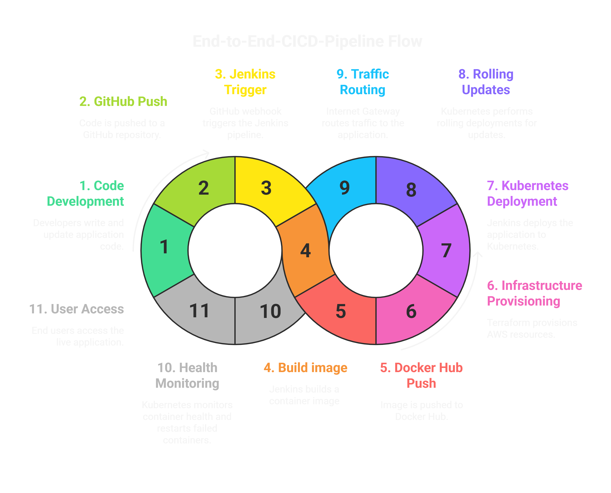

# end-to-end Cloud Native CI/CD Pipeline

### Automated DevOps pipeline showcasing modern cloud-native application deployment on AWS using Kubernetes and Infrastructure as Code

---

## Project Overview

This project presents an end-to-end Cloud-Native CI/CD pipeline that automates the building, testing, and deployment of containerized applications to a Kubernetes cluster running on AWS.

The infrastructure is fully provisioned using Terraform based on Infrastructure as Code (IaC) principles, ensuring scalable, consistent, and repeatable deployments aligned with real-world production standards.

## Architecture


### Architecture Flow:
Developer → GitHub Repository → Jenkins CI/CD Pipeline → Docker Image Creation → Docker Hub Registry → Kubernetes Deployment → Live Application → Live 
    

---

# Project Structure

```
    End-to-End-CICD-Pipeline/
    ├── README.md
    ├── terraform/
    │   ├── modules/
    │   │   ├── vpc/
    │   │   ├── security/
    │   │   └── compute/
    │   └── environments/
    │       └── dev/
    ├── kubernetes/
    │   ├── manifests/
    │   └── configs/
    ├── jenkins/
    │   ├── jobs/
    │   └── scripts/
    ├── app/
    │   ├── src/
    │   └── Dockerfile
    └── docs/
        ├── architecture.md
        └── setup-guide.md
```


## Key Files 

| File              | Purpose |
|-------------------|---------|
| **Jenkinsfile**   | Defines the complete CI/CD pipeline stages |
| **Dockerfile**    | Multi-stage Docker build for the Node.js application |
| **deployment.yaml** | Kubernetes deployment configuration with 3 replicas and health checks |
| **service.yaml**  | NodePort service exposing the application on port 30080 |
| **main.tf**       | Terraform configuration orchestrating all infrastructure modules |

---

## Technologies Used

| Category | Technology | Purpose |
|----------|------------|---------|
| **Infrastructure & Cloud** | AWS | Cloud platform (EC2, VPC, Security Groups, IAM) |
|  | Terraform | Infrastructure provisioning using IaC |
|  | Linux (Ubuntu 22.04) | Server operating system |
| **Container & Orchestration** | Docker | Containerization and image building |
|  | Kubernetes | Container orchestration platform |
| **CI/CD & Automation** | Jenkins | Continuous Integration and Deployment automation |
|  | Git & GitHub | Version control and collaboration |
|  | Groovy | Jenkins pipeline scripting |
| **Application** | Node.js | Backend runtime environment |
|  | Docker Hub | Container image registry |

### AWS Infrastructure Components

| Component | Type | Purpose | Count |
|-----------|------|---------|-------|
| **VPC** | Networking | Isolated cloud network | 1 |
| **Subnets** | Networking | Public/Private network segments | 4 |
| **Internet Gateway** | Networking | Internet connectivity | 1 |
| **NAT Gateway** | Networking | Outbound internet for private subnet | 1 |
| **Security Groups** | Security | Firewall rules | 3 |
| **Jenkins Server** | CI/CD | Automation engine | 1 x t3.small |
| **K8s Master** | Orchestration | Cluster control plane | 1 x t3.small |
| **K8s Workers** | Compute | Application workload hosting | 2 x t3.micro |
| **Elastic IPs** | Networking | Stable public IPs | 2 |

## Project Features

- End-to-end CI/CD pipeline automating build, test, and deployment
- Infrastructure provisioning using Terraform (Infrastructure as Code)
- Self-managed Kubernetes cluster built with kubeadm
- Containerized application deployment using Docker
- Rolling updates enabling zero-downtime deployments
- Multi-node cluster with load balancing and high availability
- Automated health checks and self-healing containers
- Secure AWS networking with VPC, subnets, and security groups

## End-to-End CI/CD Pipeline Deployment : Getting Started
[Project Setup Guide](docs/setup-guide.md) : Contains the complete step-by-step setup and deployment instructions for the project.

## Author
**Satish Pathade** 
- Email: pathadesatish0@gmail.com
- LinkedIn: [linkedin.com/in/satishpathade](https://www.linkedin.com/in/satish-pathade/)
